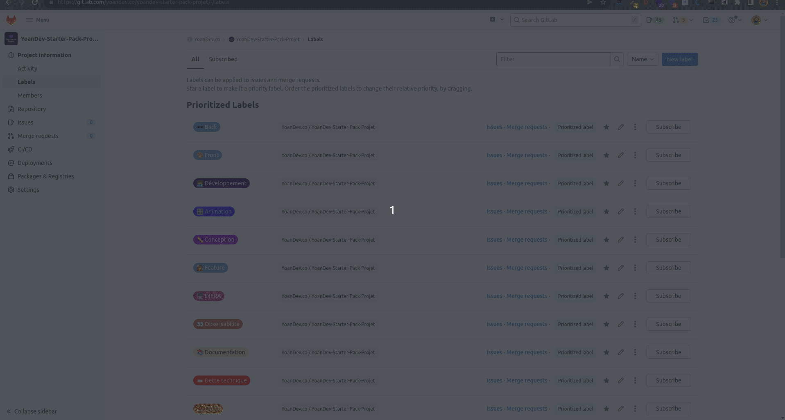
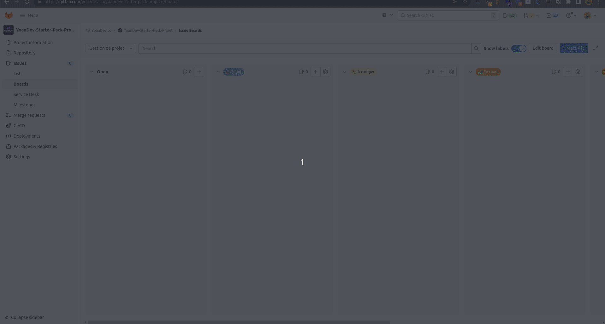
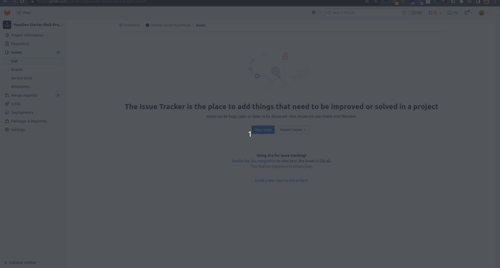
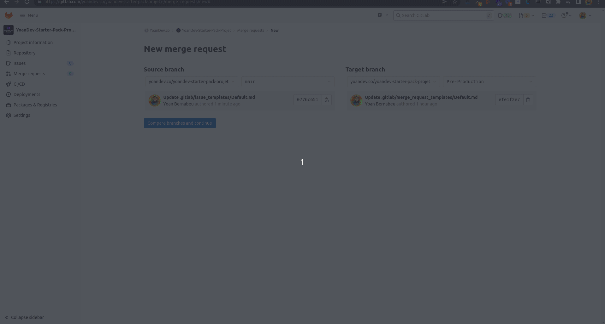

# Big trip ⛺️

Projet d'étude Epitech en équipe 🎓

**Equipe :**

- Laurent 
- Patrick
- Samy
- Adison
- François

## 1.  Table des matières

*  1. [ Table des matières](#Tabledesmatires)
*  2. [Pourquoi ce dépôt ?](#Pourquoicedpt)
*  3. [La technologie](#Technos)
*  4. [Gestion de projet](#GestionDeProjet)
	* 4.1. [Les labels](#Leslabels)
	* 4.2. [Le board](#LeBoard)
	* 4.3. [Les branches](#Lesbranches)
	* 4.4. [Les commits](#Lescommits)
	* 4.5. [Modèles pour les issues et les merges requests](#Modlespourlesissuesetlesmergesrequests)
*  5. [Les fonctionnalités](#Lesfonctions)

## 2. Pourquoi ce dépôt ?

Ce dépot à pour objectif de fournir un outil de démarrage rapide pour organiser et gérer un nouveau projet avec GitLab.

Partant du constat que le démarrage d'un projet est un processus long et complexe, j'ai voulu fournir un outil simple et efficace pour lancer un projet avec GitLab et ses outils !

## 3. La technologie

- Front : React / Next JS
- Back (API) : Symfony 6
- Base de donnée : MySQL
- Conteneurisation : Docker

## 4. Gestion de projet

- Une branche par ticket
- Un ticket par personne
- Le projet comporte 7 sprint (7 semaines de projet) 

**[Sprint 1 - Mise en place du projet](https://gitlab.com/epitech4184308/big-trip/-/milestones/1)**

**[Sprint 2 - Mise en place des environnement de développement](https://gitlab.com/epitech4184308/big-trip/-/milestones/2)**

**[Sprint 3 - Développement du projet](https://gitlab.com/epitech4184308/big-trip/-/milestones/3)**

**[Sprint 4 - Développement du projet](https://gitlab.com/epitech4184308/big-trip/-/milestones/4)**

**[Sprint 5 - Développement du projet](https://gitlab.com/epitech4184308/big-trip/-/milestones/5)**

**[Sprint 6 - Développement du projet (dernière semaine de dev)](https://gitlab.com/epitech4184308/big-trip/-/milestones/6)**

**[Sprint 7 - Debugage des derniers problèmes](https://gitlab.com/epitech4184308/big-trip/-/milestones/7)**

### 4.1. Les labels

Les labels sont des éléments qui sont associés à des issues et merges requests et qui permettent de les classer, le organiser et de les identifier simplement.

### 4.2. Le board  

Le Board est l'outil central de GitLab pour organiser et gérer votre projet.

Il va vous permettre de visualiser les différentes tâches que vous avez à accomplir, et de suivre leur progression.

La structure de ce board adopte l'approche [Scrumban](https://asana.com/fr/resources/scrumban).

### 4.3. Les branches

Les quatres branches proposées dans ce template permettent de gérer de manière simple l'état du déploiement de votre projet.
 
Elles sont particulièrement utiles si vous leurs associez des pipelines GitLab CI pour automatiser le déploiement de votre projet en fonction des branches.

Ce modèle s'inspire librement de l'approche [GitLab Flow](https://www.youtube.com/watch?v=ZJuUz5jWb44).

- Main : (branche utilisé pour les README etc)
- Develop : (branche de dev) les feature : partiront de cette branche
- Pré-production
- Production

**Branche d'exemple** : FEATURE/FRONT#001-MISE-EN-PLACE

**IMPORTANT :**  Avant de créer une branche, passez sur la branche develop. 
Faites de préférence toujours un git pull pour être sûr d’être à jour. La nouvelle branche que vous venez de créer a été rapatriée. 
Après cela, fâites un git checkout -b [FEATURE/FRONT#001-MISE-EN-PLACE]
  
### 4.4. Les commits

**Exemple de message de commit** : FRONT#001 Mise en place

**Rappel :** `git commit -m "FRONT#001 Mise en place"`
  
### 4.5. Modèles pour les issues et les merges requests

Ce template propose des modèles pour les issues et les merges requests afin de simplifier et standardiser leur utilisation par les équipes du projet.

## 5. Les fonctionnalités
  
NEWS : 

Un utilisateur non connecté peux : 

> - s'inscrire
> - se connecter
> - demander un nouveau mot de passe
> - rechercher une destination
>     - voir les evenements de cette destination
>     - voir les logements de cette destination
>     - voir les vols pour cette destination
> -  voir les trip public

Un utilisateur connecté peux :

> - s'inscrire
> - se connecter
> - demander un nouveau mot de passe
> - rechercher une destination
>     - voir les evenements de cette destination
>     - voir les logements de cette destination
>     - voir les vols pour cette destination
> - voir les trip public
> ---------
> - CRUD sur son trip (public/privé)
> - voir le détail du trip crée 
> - partager un trip (partage du détail du trip en lecture seul) -> on partage l'url simplement via un bouton partage qui envoi un mail par exemple
> - modifier son mot de passe
> - contacté un admin
> 

Bonus : (!!! pas dans le schéma de la DB !!!)

> 
> Un utilisateur connecté peux :
> 
> - rejoindre un trip par invitation
> - séparer une note de frais (somme du trip)modifier son profil
> 
> Un administrateur peux :
> 
> - regénérer un mot de passe pour un utilisateur
> - CRUD utilisateur
> - CRUD sur les trips (public et privé) -> a voir pour la confidentialité de la somme
> - être contacté pour un utilisateur
> 
